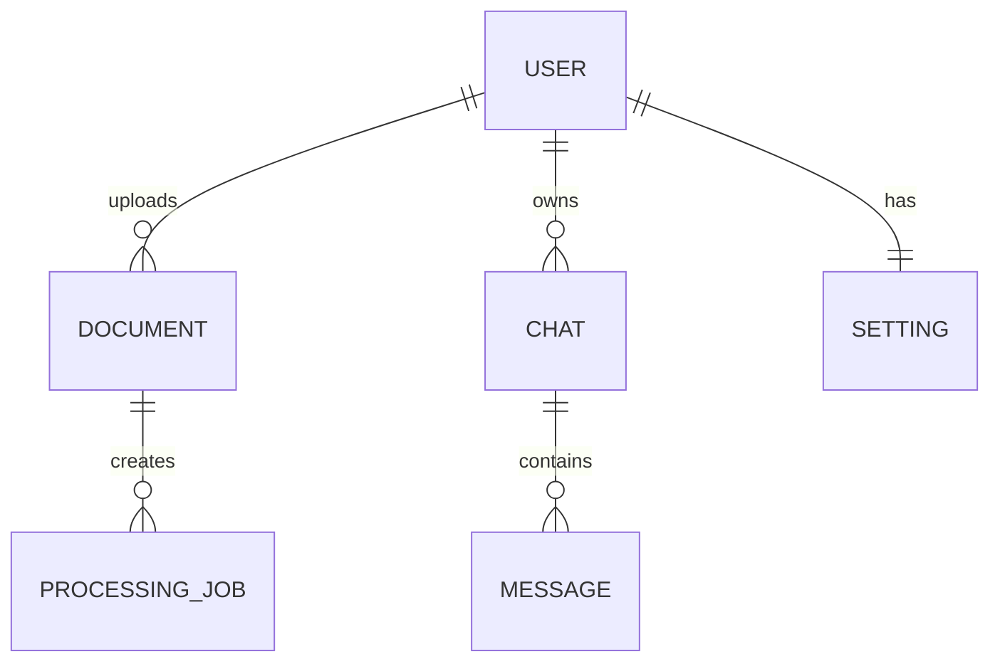
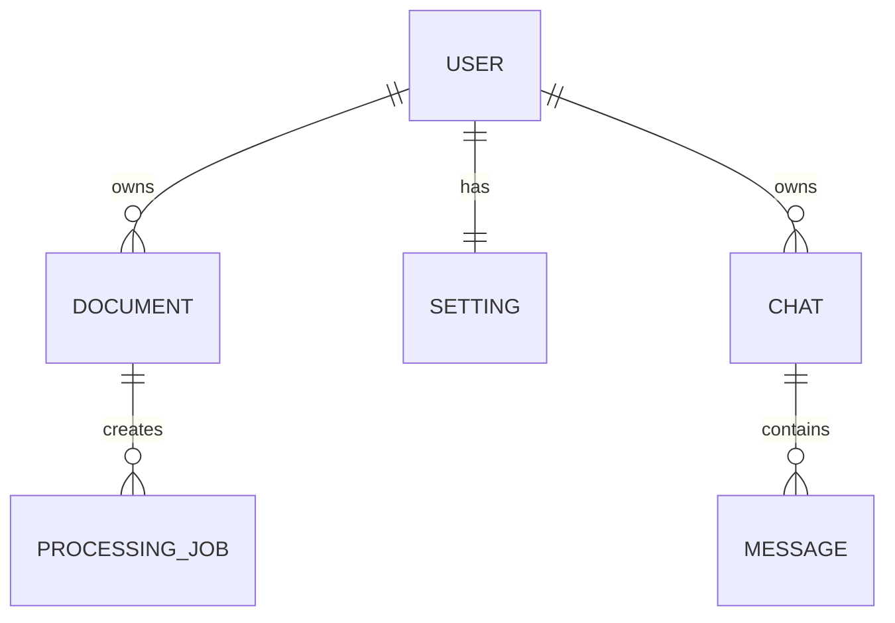

# Database Design

# Atlas

**Version:** 1.0.0

**Database Type:** Hybrid Database Architecture

**Relational Database:** PostgreSQL

**Vector Database:** ChromaDB

**Storage:** Local File System (Future: Amazon S3)

---

# Table of Contents

1. Introduction
2. Database Architecture
3. Design Principles
4. Database Selection
5. High-Level Database Architecture
6. Conceptual Data Model
7. Entity Relationship Diagram
8. PostgreSQL Schema
9. Relationships
10. Constraints

---

# 1. Introduction

Atlas uses a **hybrid persistence architecture** because no single database is suitable for storing every type of data in a Retrieval-Augmented Generation (RAG) system.

Instead, Atlas separates data according to its purpose.

| Data Type     | Storage       |
| ------------- | ------------- |
| User Accounts | PostgreSQL    |
| Documents     | Local Storage |
| Metadata      | PostgreSQL    |
| Chats         | PostgreSQL    |
| Settings      | PostgreSQL    |
| Embeddings    | ChromaDB      |

This architecture keeps structured data, unstructured files, and vector embeddings independent while allowing them to work together efficiently.

---

# 2. Database Architecture

```
                    Atlas

                      │

        ┌─────────────┼─────────────┐

        ▼             ▼             ▼

 PostgreSQL      Local Storage    ChromaDB

 Structured        Original        Embeddings

     Data          Documents         & Search
```

---

# 3. Database Design Principles

Atlas follows the following principles.

## Separation of Concerns

Each storage system stores only the data it is designed for.

PostgreSQL

- Structured Data

Local Storage

- Files

ChromaDB

- Embeddings

---

## Normalization

Relational tables are normalized to reduce

- Duplication
- Inconsistency
- Storage Waste

Target

Third Normal Form (3NF)

---

## Scalability

The design supports future migration to

- Amazon S3
- Pinecone
- Milvus
- Weaviate
- Qdrant

without redesigning business logic.

---

## Maintainability

Every entity has

- Single Responsibility
- UUID Primary Key
- Audit Fields
- Clear Relationships

---

# 4. Database Selection

## PostgreSQL

Chosen because

- ACID Compliance
- Excellent Performance
- Mature Ecosystem
- Strong Indexing
- JSON Support
- Full-Text Search
- Open Source

Stores

- Users
- Documents
- Chats
- Settings
- Metadata

---

## ChromaDB

Chosen because

- Easy Local Development
- Fast Similarity Search
- Python Native
- Lightweight
- Open Source

Stores

- Embeddings
- Chunk Metadata
- Vector Index

---

## Local Storage

Stores

- Uploaded PDFs
- DOCX
- TXT
- Markdown

Reason

Original files should remain available for

- Download
- Preview
- Reprocessing

---

# 5. High-Level Storage Architecture

```mermaid
flowchart LR

User

↓

Upload

↓

FastAPI

↓

PostgreSQL

FastAPI

↓

Local Storage

FastAPI

↓

ChromaDB
```

---

# 6. Conceptual Data Model

Atlas contains the following primary entities.

```
User

↓

Documents

↓

Document Chunks

↓

Embeddings

↓

Chat

↓

Messages

↓

Settings
```

---

## Entity Descriptions

### User

Represents an authenticated account.

---

### Document

Represents an uploaded file.

---

### Chunk

Represents a section of a processed document.

Stored inside ChromaDB.

---

### Embedding

Vector representation of a chunk.

Stored inside ChromaDB.

---

### Chat

Conversation between user and Atlas.

---

### Message

Single conversation entry.

---

### Settings

User-specific preferences.

---

# 7. Entity Relationship Diagram



---

## Relationship Summary

| Parent   | Child          | Relationship |
| -------- | -------------- | ------------ |
| User     | Documents      | One-to-Many  |
| User     | Chats          | One-to-Many  |
| User     | Settings       | One-to-One   |
| Chat     | Messages       | One-to-Many  |
| Document | Processing Job | One-to-Many  |

---

# 8. PostgreSQL Schema

Atlas uses the following tables.

```
users

documents

processing_jobs

chats

messages

settings

api_keys
```

---

# 9. Table: users

Purpose

Stores user accounts.

| Column        | Type         | Constraints   |
| ------------- | ------------ | ------------- |
| id            | UUID         | Primary Key   |
| name          | VARCHAR(120) | NOT NULL      |
| email         | VARCHAR(255) | UNIQUE        |
| password_hash | TEXT         | NOT NULL      |
| avatar_url    | TEXT         | NULL          |
| provider      | VARCHAR(30)  | DEFAULT local |
| is_verified   | BOOLEAN      | DEFAULT FALSE |
| created_at    | TIMESTAMP    | NOT NULL      |
| updated_at    | TIMESTAMP    | NOT NULL      |

---

## Indexes

```
PRIMARY KEY(id)

UNIQUE(email)

INDEX(created_at)
```

---

# 10. Table: documents

Purpose

Stores metadata of uploaded documents.

| Column            | Type      |
| ----------------- | --------- |
| id                | UUID      |
| owner_id          | UUID      |
| title             | VARCHAR   |
| filename          | VARCHAR   |
| file_path         | TEXT      |
| file_type         | VARCHAR   |
| size              | BIGINT    |
| page_count        | INTEGER   |
| chunk_count       | INTEGER   |
| processing_status | VARCHAR   |
| uploaded_at       | TIMESTAMP |
| updated_at        | TIMESTAMP |

---

## Foreign Keys

```
owner_id

↓

users.id
```

---

## Indexes

```
PRIMARY KEY(id)

INDEX(owner_id)

INDEX(file_type)

INDEX(processing_status)

INDEX(uploaded_at)
```

---

# 11. Table: chats

Purpose

Stores conversations.

| Column     | Type      |
| ---------- | --------- |
| id         | UUID      |
| owner_id   | UUID      |
| title      | VARCHAR   |
| created_at | TIMESTAMP |
| updated_at | TIMESTAMP |

---

## Relationships

```
owner_id

↓

users.id
```

---

## Indexes

```
PRIMARY KEY(id)

INDEX(owner_id)
```

---

# 12. Table: messages

Purpose

Stores conversation messages.

| Column      | Type      |
| ----------- | --------- |
| id          | UUID      |
| chat_id     | UUID      |
| role        | VARCHAR   |
| content     | TEXT      |
| token_count | INTEGER   |
| created_at  | TIMESTAMP |

---

## Role Values

```
user

assistant

system
```

---

## Relationships

```
chat_id

↓

chats.id
```

---

# 13. Table: settings

Purpose

Stores user preferences.

| Column          | Type    |
| --------------- | ------- |
| id              | UUID    |
| owner_id        | UUID    |
| theme           | VARCHAR |
| llm_provider    | VARCHAR |
| embedding_model | VARCHAR |
| temperature     | FLOAT   |
| top_k           | INTEGER |
| chunk_size      | INTEGER |
| overlap         | INTEGER |

---

## Relationship

```
owner_id

↓

users.id
```

---

# 14. Table: processing_jobs

Purpose

Tracks background processing.

| Column       | Type      |
| ------------ | --------- |
| id           | UUID      |
| document_id  | UUID      |
| status       | VARCHAR   |
| progress     | INTEGER   |
| current_step | VARCHAR   |
| started_at   | TIMESTAMP |
| completed_at | TIMESTAMP |

---

## Status Values

```
queued

running

completed

failed
```

---

## Relationship

```
document_id

↓

documents.id
```

---

# 15. Database Constraints

## User Constraints

- Email must be unique.
- Password hash cannot be NULL.
- UUID generated automatically.

---

## Document Constraints

- Every document belongs to one user.
- File type must be one of

```
pdf

docx

txt

md
```

- File size must be greater than zero.

---

## Chat Constraints

- Chat owner cannot change.
- Messages cannot exist without a chat.

---

## Processing Constraints

- Every processing job belongs to one document.
- Progress ranges from 0–100.

# 16. ChromaDB Design

Atlas uses **ChromaDB** as the vector database responsible for semantic retrieval.

Unlike PostgreSQL, ChromaDB stores high-dimensional vector embeddings instead of relational data.

---

# Collection Design

Atlas uses one logical collection per environment.

Example

```
atlas_documents
```

Future enhancement

Multi-tenant collections

```
atlas_user_001

atlas_user_002
```

or

Shared collection with metadata filtering.

---

# Collection Schema

Each record contains

| Field     | Description           |
| --------- | --------------------- |
| id        | Unique Chunk ID       |
| embedding | Vector Representation |
| document  | Original Chunk Text   |
| metadata  | Structured Metadata   |

---

# Example Record

```json
{
  "id": "chunk_001",
  "embedding": [0.012, -0.221, 0.552, "..."],
  "document": "Retrieval-Augmented Generation combines retrieval with language models.",
  "metadata": {
    "document_id": "doc_001",
    "user_id": "user_001",
    "page": 12,
    "chunk_index": 18,
    "filename": "rag-guide.pdf"
  }
}
```

---

# Metadata Design

Every vector stores searchable metadata.

| Field       | Purpose         |
| ----------- | --------------- |
| user_id     | Ownership       |
| document_id | Parent Document |
| filename    | Display Sources |
| page        | Citation        |
| chunk_index | Chunk Order     |
| uploaded_at | Audit           |
| file_type   | Filtering       |

---

# Why Metadata Matters

Metadata allows Atlas to

- Filter by user
- Filter by document
- Cite sources
- Delete embeddings
- Rebuild indexes

Without metadata, vectors cannot be safely managed.

---

# 17. Chunk Data Model

Every uploaded document is divided into overlapping chunks.

Example

```
Chunk Size

500 Tokens
```

```
Overlap

100 Tokens
```

---

## Chunk Structure

```json
{
  "chunk_id": "chunk_101",
  "document_id": "doc_001",
  "page": 6,
  "chunk_index": 14,
  "text": "...",
  "token_count": 487
}
```

---

## Why Overlap?

Without overlap

```
Chunk A

Sentence Ends

Chunk B

Sentence Starts
```

Important context may be split.

With overlap

```
Chunk A

Sentence Ends

↓

Overlap

↓

Chunk B
```

Context is preserved.

---

# 18. Embedding Design

Each chunk generates one embedding.

```
Chunk

↓

Embedding Model

↓

Vector

↓

ChromaDB
```

---

## Example

```
Chunk

"The Transformer uses self-attention..."
```

↓

```
[0.0041,
-0.2834,
0.1188,
...
768 values]
```

---

# Embedding Metadata

Stored together with

- Document ID
- User ID
- Chunk Number
- Page Number

---

# 19. File Storage Design

Original files are stored separately from databases.

Directory Structure

```
storage/

│

├── users/

│

│   ├── user_001/

│   │

│   ├── documents/

│   ├── exports/

│   └── temp/

│

└── logs/
```

---

## Document Example

```
storage/

users/

user_001/

documents/

rag-guide.pdf
```

---

## Why Store Original Files?

Original documents are required for

- Download
- Preview
- Reprocessing
- OCR (Future)
- Versioning (Future)

---

# 20. Storage Workflow

```
Upload

↓

Validate

↓

Save Original File

↓

Create Metadata

↓

Extract Text

↓

Chunk

↓

Embedding

↓

Store Vector
```

---

# 21. Database Relationships



---

# 22. Data Lifecycle

Every document follows the same lifecycle.

```
Uploaded

↓

Validated

↓

Stored

↓

Extracted

↓

Chunked

↓

Embedded

↓

Indexed

↓

Queryable

↓

Deleted
```

Deletion removes

- Original File
- Metadata
- Embeddings
- Processing Records

---

# 23. Indexing Strategy

## PostgreSQL Indexes

Indexes improve query performance.

Users

```
email
```

Documents

```
owner_id

processing_status

uploaded_at

file_type
```

Chats

```
owner_id

updated_at
```

Messages

```
chat_id
```

---

## ChromaDB Index

Managed internally.

Optimized for

- Cosine Similarity
- Approximate Nearest Neighbor Search
- Top-K Retrieval

---

# 24. Query Optimization

Atlas minimizes unnecessary database operations.

## PostgreSQL

- Indexed searches
- Pagination
- Projection (select required columns only)
- Foreign key indexing

---

## ChromaDB

- Metadata filtering
- Top-K retrieval
- User filtering
- Collection caching

---

# 25. Backup Strategy

## PostgreSQL

Frequency

Daily

Method

```
pg_dump
```

---

## ChromaDB

Frequency

Daily

Method

Collection export

---

## Documents

Frequency

Daily

Method

Filesystem backup

Future

Cloud object storage replication

---

# 26. Recovery Strategy

Recovery Order

```
Restore PostgreSQL

↓

Restore Files

↓

Restore ChromaDB

↓

Verify Metadata

↓

Rebuild Missing Embeddings (if needed)
```

---

# 27. Migration Strategy

Future database migrations use

```
Alembic
```

Migration Categories

- Schema Changes
- New Tables
- Index Changes
- Constraints
- Seed Data

Migration Rules

- Backward compatible where possible
- Reviewed before production
- Tested in staging

---

# 28. Data Integrity Rules

The following integrity rules shall always hold.

## Users

- Email is unique.
- User ID is immutable.

---

## Documents

- Must belong to one user.
- File path must exist.
- Metadata and file remain synchronized.

---

## Chats

- Cannot exist without a valid owner.

---

## Messages

- Cannot exist without a chat.

---

## Vectors

- Every vector must reference an existing document.
- Every vector must include metadata.
- No orphaned embeddings after deletion.

---

# 29. Storage Capacity Planning

Estimated storage consumption

| Component           | Estimated Size |
| ------------------- | -------------- |
| PostgreSQL Metadata | Low            |
| Original Documents  | Medium         |
| Embeddings          | High           |
| Logs                | Low            |

For large deployments, embedding storage will become the primary consumer of disk space.

---

# 30. Future Storage Improvements

Atlas is intentionally designed to allow future upgrades without redesigning the application.

## Relational Database

Current

- PostgreSQL

Future

- PostgreSQL Cluster
- Managed Cloud PostgreSQL

---

## Document Storage

Current

- Local Filesystem

Future

- Amazon S3
- Azure Blob Storage
- Google Cloud Storage

---

## Vector Database

Current

- ChromaDB

Future

- Pinecone
- Qdrant
- Weaviate
- Milvus
- pgvector

---

# 31. Database Design Summary

Atlas employs a hybrid persistence architecture:

- **PostgreSQL** manages structured application data such as users, documents, chats, settings, and processing jobs.
- **Local Storage** preserves the original uploaded files for download, preview, and future reprocessing.
- **ChromaDB** stores document embeddings and metadata to enable efficient semantic retrieval.

This separation ensures that each storage technology is used for the type of data it handles best, providing a scalable, maintainable, and production-ready foundation for the Atlas Naive RAG system.
