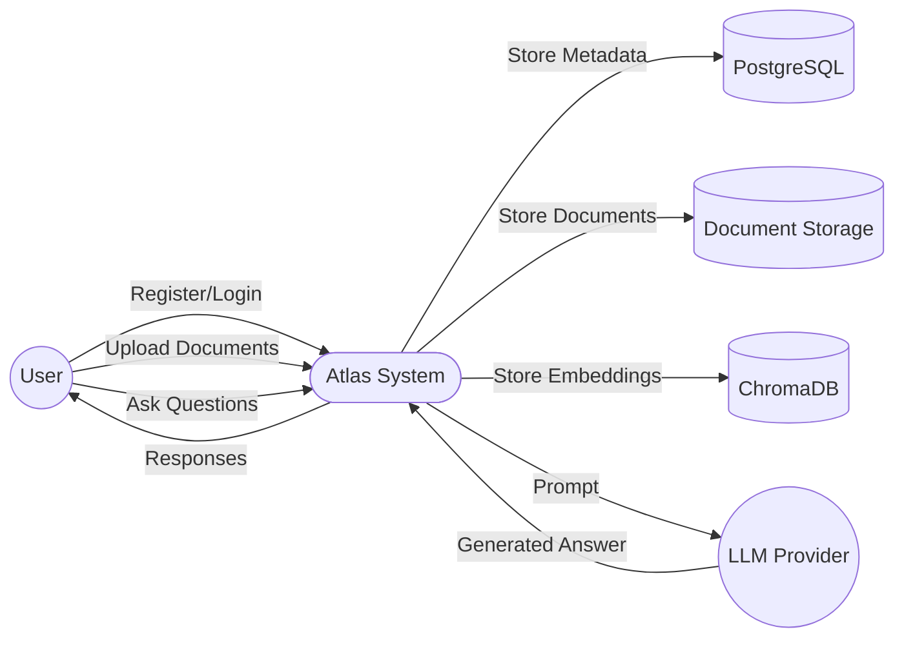
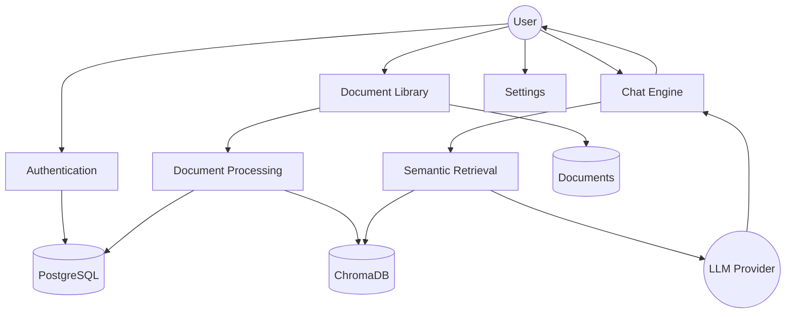
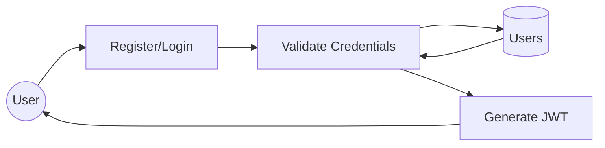
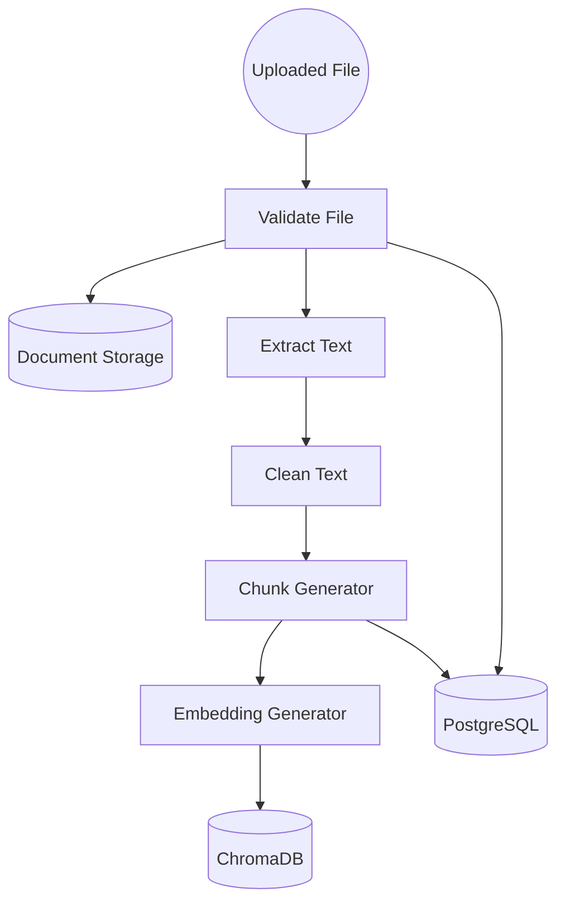
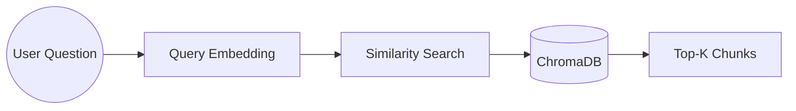
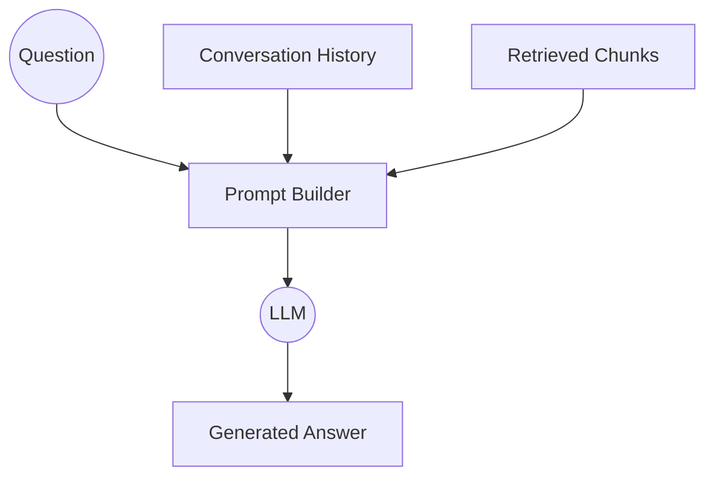
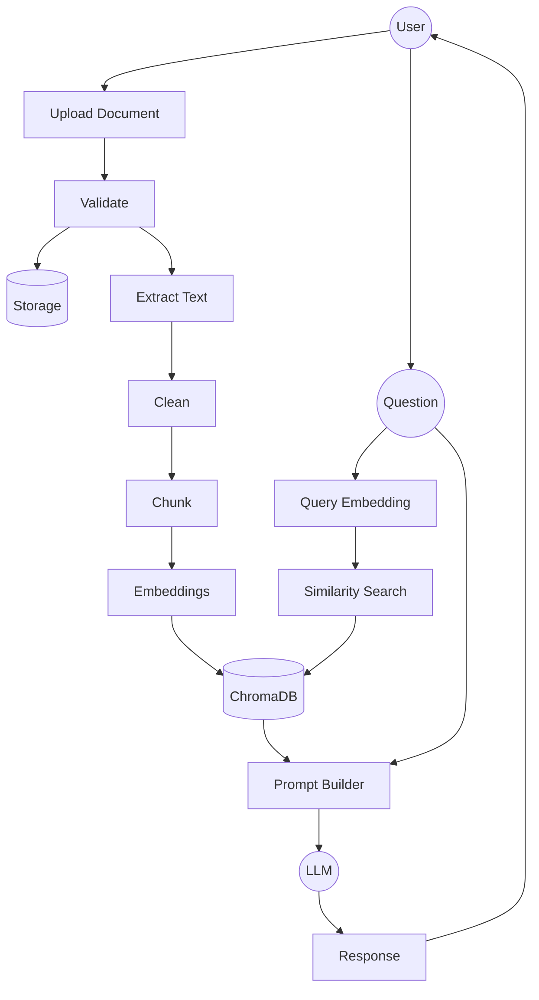

# Data Flow Diagram (DFD)

# Atlas

**Project:** Atlas

**Architecture:** Naive Retrieval-Augmented Generation (Naive RAG)

**Version:** 1.0

---

# Table of Contents

1. Introduction
2. DFD Symbols
3. Context Diagram (Level 0)
4. Level 1 DFD
5. Level 2 DFD
   - Authentication
   - Document Processing
   - Semantic Retrieval
   - AI Chat
6. Data Stores
7. External Entities
8. Data Dictionary

---

# 1. Introduction

A Data Flow Diagram (DFD) illustrates how data moves throughout the Atlas system.

Unlike architecture diagrams, a DFD focuses on:

- Data movement
- Processing steps
- Inputs
- Outputs
- Data stores

Atlas follows a Naive Retrieval-Augmented Generation workflow consisting of two major pipelines:

- Document Indexing Pipeline
- Retrieval Pipeline

---

# 2. DFD Symbols

| Symbol          | Meaning                                         |
| --------------- | ----------------------------------------------- |
| External Entity | User or external service interacting with Atlas |
| Process         | Performs operations on data                     |
| Data Flow       | Movement of information                         |
| Data Store      | Permanent data storage                          |

---

# 3. Context Diagram (Level 0)

Level 0 represents Atlas as one single process.



---

## Context Explanation

External Entities

- User
- LLM Provider

Internal System

- Atlas

Persistent Storage

- PostgreSQL
- ChromaDB
- Document Storage

---

# 4. Level 1 DFD

Atlas is divided into major subsystems.



---

## Level 1 Processes

### Authentication

Responsible for

- Registration
- Login
- JWT
- Authorization

---

### Document Library

Responsible for

- Upload
- Delete
- Rename
- Metadata

---

### Document Processing

Responsible for

- Extraction
- Cleaning
- Chunking
- Embeddings

---

### Semantic Retrieval

Responsible for

- Query Embedding
- Similarity Search
- Context Retrieval

---

### Chat

Responsible for

- Prompt Construction
- LLM Communication
- Conversation History

---

### Settings

Responsible for

- Theme
- AI Configuration
- Retrieval Configuration

---

# 5. Level 2 DFD

---

# 5.1 Authentication Module



---

## Data Flow

User

↓

Credentials

↓

Validation

↓

Database Lookup

↓

JWT Generation

↓

Authenticated User

---

# 5.2 Document Processing Module



---

## Processing Flow

Upload

↓

Validation

↓

Store Original File

↓

Extract Text

↓

Clean Content

↓

Generate Chunks

↓

Generate Embeddings

↓

Store Vectors

↓

Update Metadata

---

# 5.3 Semantic Retrieval Module



---

## Retrieval Flow

User Question

↓

Query Embedding

↓

Similarity Search

↓

Top-K Chunks

---

# 5.4 AI Chat Module



---

## Prompt Construction

The prompt consists of

```
System Prompt

+

Conversation History

+

Retrieved Chunks

+

Current Question
```

↓

LLM

↓

Response

---

# 6. Complete Data Flow



---

# 7. Data Stores

## D1 User Database

Technology

PostgreSQL

Stores

- User Accounts
- Sessions
- Preferences

---

## D2 Document Storage

Technology

Local Storage

Stores

- Original Files

Supported Formats

- PDF
- DOCX
- TXT
- Markdown

---

## D3 Metadata Database

Technology

PostgreSQL

Stores

- Document Metadata
- Processing Status
- Chats

---

## D4 Vector Database

Technology

ChromaDB

Stores

- Embeddings
- Chunk Metadata
- Similarity Index

---

# 8. External Entities

## User

Provides

- Credentials
- Documents
- Questions

Receives

- AI Responses
- Search Results
- Processing Status

---

## LLM Provider

Receives

- Prompt

Returns

- AI Generated Response

---

# 9. Data Dictionary

| Data              | Description                    |
| ----------------- | ------------------------------ |
| User Credentials  | Email & Password               |
| JWT Token         | Authentication Token           |
| Uploaded Document | Original User File             |
| Extracted Text    | Raw Text from File             |
| Clean Text        | Normalized Text                |
| Chunk             | Small Text Segment             |
| Embedding         | Vector Representation          |
| Query Embedding   | Vector of User Question        |
| Retrieved Chunks  | Most Similar Document Segments |
| Prompt            | Context + Question             |
| AI Response       | Final Generated Answer         |
| Metadata          | Document Information           |
| Conversation      | Chat History                   |

---

# 10. DFD Summary

Atlas consists of two primary data pipelines:

## Indexing Pipeline

```
Upload Document

↓

Validation

↓

Storage

↓

Text Extraction

↓

Cleaning

↓

Chunking

↓

Embedding Generation

↓

Vector Database
```

---

## Retrieval Pipeline

```
User Question

↓

Query Embedding

↓

Similarity Search

↓

Retrieve Top-K Chunks

↓

Prompt Construction

↓

LLM

↓

Grounded Response
```

These two pipelines together implement the complete **Naive Retrieval-Augmented Generation (Naive RAG)** workflow used by Atlas.
