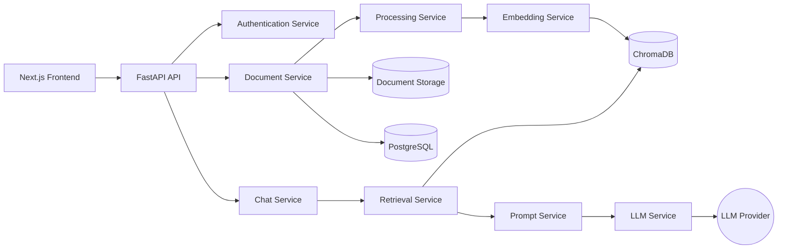
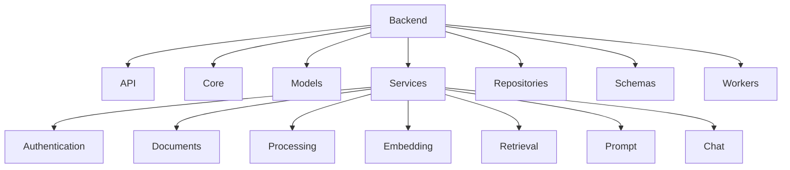
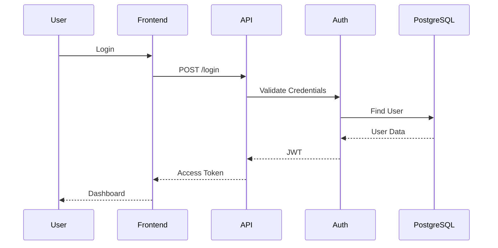
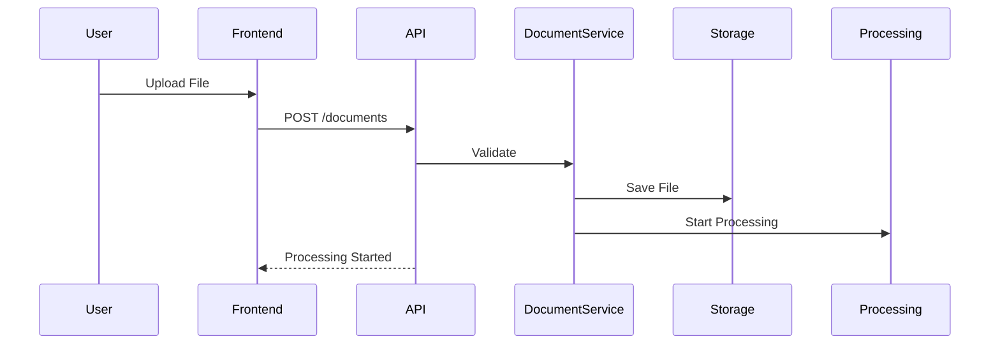
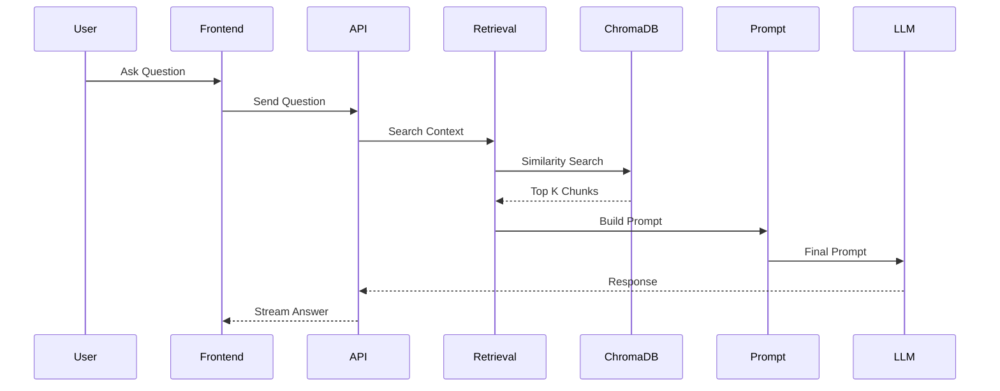

# System Architecture

# Atlas

**Version:** 1.0.0

**Architecture Style:** Clean Architecture + Layered Architecture + Service-Oriented Design

**RAG Type:** Naive Retrieval-Augmented Generation

---

# Table of Contents

1. Introduction
2. Architectural Goals
3. Architectural Principles
4. High-Level Architecture
5. Layered Architecture
6. Clean Architecture
7. Component Architecture
8. Service Architecture
9. Backend Architecture
10. Frontend Architecture

---

# 1. Introduction

The System Architecture document defines the structural design of Atlas.

It explains:

- How the system is organized
- How components communicate
- Why architectural decisions were made
- How data flows through the application
- How Atlas remains scalable and maintainable

Unlike the DFD, which focuses on **data flow**, this document focuses on **software structure**.

---

# 2. Architectural Goals

Atlas is designed to achieve the following goals:

## Functional Goals

- Modular design
- Reliable AI responses
- Secure authentication
- Efficient document retrieval
- Responsive user experience

---

## Engineering Goals

- High maintainability
- Loose coupling
- High cohesion
- Scalability
- Testability
- Extensibility

---

## AI Goals

- Accurate semantic retrieval
- Configurable LLM providers
- Configurable embedding models
- Low hallucination
- Source-grounded responses

---

# 3. Architectural Principles

Atlas follows these architectural principles.

## Separation of Concerns

Each component has one clearly defined responsibility.

Examples

Authentication

↓

Only authentication

Retrieval

↓

Only semantic retrieval

LLM

↓

Only response generation

---

## Single Responsibility Principle

Every service performs exactly one task.

Examples

Embedding Service

↓

Generate embeddings

Prompt Service

↓

Construct prompts

Retrieval Service

↓

Retrieve context

---

## Dependency Inversion

High-level modules never depend directly on implementation details.

Instead

```
Controller

↓

Interface

↓

Implementation
```

Example

```
EmbeddingService

↓

EmbeddingProvider Interface

↓

SentenceTransformerProvider
```

This allows replacing embedding models without changing business logic.

---

## Open-Closed Principle

Atlas should be

Open for extension

Closed for modification

Example

Adding

```
Qdrant
```

should require implementing a new repository rather than modifying existing retrieval logic.

---

# 4. High-Level Architecture

```mermaid
flowchart TB

User

↓

Frontend

↓

API Gateway

↓

Application Layer

↓

Business Services

↓

Persistence Layer

↓

External Services
```

---

## High-Level Layers

### Presentation Layer

Handles

- User Interface
- User Interaction
- Navigation
- Rendering

Technology

Next.js

---

### API Layer

Handles

- REST APIs
- Validation
- Authentication
- Routing

Technology

FastAPI

---

### Business Layer

Contains

- Authentication
- Retrieval
- Prompt Building
- Chat
- Document Processing

---

### Data Layer

Contains

- PostgreSQL
- ChromaDB
- Local Storage

---

### External Services

Contains

- Gemini
- OpenAI
- Claude
- Ollama

---

# 5. Layered Architecture

```mermaid
flowchart TB

Presentation

↓

Controllers

↓

Services

↓

Repositories

↓

Databases
```

---

## Layer Responsibilities

### Presentation

Responsible for

- Rendering UI
- User Input
- Client-side Validation

---

### Controllers

Responsible for

- HTTP Requests
- Request Validation
- Calling Services

---

### Services

Responsible for

- Business Logic
- AI Processing
- Retrieval
- Authentication

---

### Repositories

Responsible for

- Database Access
- CRUD Operations

---

### Database

Responsible for

- Persistent Storage

---

# 6. Clean Architecture

Atlas follows Clean Architecture.

```mermaid
flowchart LR

UI

-->

API

-->

Use Cases

-->

Entities

<--

Repositories

<--

Database
```

---

## Layer Description

### Entities

Contain

Core business models.

Examples

- User
- Document
- Chat
- Message

---

### Use Cases

Contain

Business rules.

Examples

- Upload Document
- Generate Embedding
- Retrieve Context
- Ask Question

---

### Interface Adapters

Contain

- Controllers
- Repositories
- DTOs
- Serializers

---

### Framework Layer

Contains

- FastAPI
- PostgreSQL
- ChromaDB
- Redis

---

# 7. Component Architecture

```mermaid
flowchart LR

Frontend

↓

API

↓

Authentication

↓

Document Service

↓

Processing Service

↓

Embedding Service

↓

Retrieval Service

↓

Prompt Service

↓

LLM Service

↓

Response
```

---

## Components

### Authentication

Purpose

Identity management.

---

### Document Service

Purpose

Document CRUD.

---

### Processing Service

Purpose

Extraction

Cleaning

Chunking

---

### Embedding Service

Purpose

Generate embeddings.

---

### Retrieval Service

Purpose

Similarity search.

---

### Prompt Service

Purpose

Construct prompts.

---

### LLM Service

Purpose

Generate AI responses.

---

# 8. Service Architecture

Every service communicates through interfaces.

```
Controller

↓

Service

↓

Repository

↓

Database
```

Each service can be tested independently.

---

# Authentication Service

Responsibilities

- Register
- Login
- JWT
- Password Hashing

---

# Document Service

Responsibilities

- Upload
- Rename
- Delete
- Metadata

---

# Processing Service

Responsibilities

- Text Extraction
- Cleaning
- Chunking

---

# Embedding Service

Responsibilities

- Generate embeddings
- Batch processing

---

# Retrieval Service

Responsibilities

- Query embedding
- Similarity search
- Context retrieval

---

# Prompt Service

Responsibilities

- Prompt templates
- Token budgeting
- Context formatting

---

# Chat Service

Responsibilities

- Conversation history
- Streaming
- Message persistence

---

# Settings Service

Responsibilities

- User preferences
- Theme
- AI configuration

---

# 9. Backend Architecture

```mermaid
flowchart TB

FastAPI

↓

Routers

↓

Controllers

↓

Services

↓

Repositories

↓

PostgreSQL

ChromaDB

Storage
```

---

## Request Lifecycle

```
HTTP Request

↓

Router

↓

Controller

↓

Service

↓

Repository

↓

Database

↓

Response
```

---

## Why This Structure?

Benefits

- Easy testing
- Loose coupling
- High maintainability
- Clear responsibilities
- Independent services

---

# 10. Frontend Architecture

```mermaid
flowchart TB

Pages

↓

Layouts

↓

Components

↓

Hooks

↓

Services

↓

REST API
```

---

## Frontend Layers

### Pages

Responsible for

- Routing
- Page composition

---

### Layouts

Responsible for

- Navigation
- Sidebar
- Navbar

---

### Components

Reusable UI

Examples

- Button
- Modal
- Chat
- Document Card

---

### Hooks

Business logic for UI.

Examples

- useDocuments()
- useChat()
- useAuth()

---

### Services

Responsible for

REST API communication.

---

### State Management

Uses

- Zustand (client state)
- TanStack Query (server state)

---

# Architectural Summary

Atlas combines **Clean Architecture**, **Layered Architecture**, and **Service-Oriented Design** to create a modular AI application.

Each layer depends only on the layer directly beneath it, while business logic remains isolated from infrastructure concerns. This architecture enables Atlas to evolve from a simple Naive RAG application into more advanced RAG systems without major structural changes.

# 11. Component Diagram

The following diagram illustrates the major software components of Atlas and their interactions.



---

# Component Responsibilities

| Component          | Responsibility             |
| ------------------ | -------------------------- |
| Frontend           | User interaction           |
| API                | Request routing            |
| Authentication     | Identity & Authorization   |
| Document Service   | Document CRUD              |
| Processing Service | Text extraction & chunking |
| Embedding Service  | Vector generation          |
| Retrieval Service  | Semantic search            |
| Prompt Service     | Prompt construction        |
| Chat Service       | Conversation management    |
| LLM Service        | AI provider communication  |

---

# 12. Package Diagram



---

## Package Description

### API

Contains

- Routers
- Controllers
- Dependencies

---

### Core

Contains

- Configuration
- Security
- Logging
- Constants

---

### Models

Contains

- SQLAlchemy Models

---

### Schemas

Contains

- Pydantic Models

---

### Services

Contains business logic.

---

### Repositories

Contains

Database access logic.

---

### Workers

Contains

Background processing jobs.

---

# 13. Deployment Architecture

```mermaid
flowchart TB

User

↓

Browser

↓

Nginx

↓

Next.js

↓

FastAPI

↓

Redis

↓

PostgreSQL

FastAPI

↓

ChromaDB

FastAPI

↓

Document Storage

FastAPI

↓

Gemini/OpenAI
```

---

## Deployment Components

### Browser

Runs the client application.

---

### Nginx

Acts as

- Reverse Proxy
- SSL Termination
- Static Asset Server

---

### Next.js

Serves the frontend.

---

### FastAPI

Processes business logic.

---

### Redis

Provides

- Background queues
- Caching
- Rate limiting

---

### PostgreSQL

Stores relational data.

---

### ChromaDB

Stores embeddings.

---

### Local Storage

Stores original files.

---

### LLM Provider

Generates AI responses.

---

# 14. Authentication Sequence Diagram



---

# Authentication Flow

```
Login

↓

Validate

↓

Generate JWT

↓

Store Session

↓

Return Access Token
```

---

# 15. Document Upload Sequence



---

# Upload Workflow

```
Upload

↓

Validation

↓

Save

↓

Queue Processing

↓

Return Success
```

---

# 16. Indexing Pipeline

Atlas creates searchable knowledge using the indexing pipeline.

```mermaid
flowchart LR

Upload

↓

Extract

↓

Clean

↓

Chunk

↓

Embed

↓

Store

↓

Ready
```

---

## Pipeline Description

### Upload

Receive document.

↓

### Extraction

Extract text.

↓

### Cleaning

Normalize content.

↓

### Chunking

Split into semantic chunks.

↓

### Embedding

Generate vectors.

↓

### Storage

Store embeddings inside ChromaDB.

---

# 17. Retrieval Pipeline

```mermaid
flowchart LR

Question

↓

Embedding

↓

Similarity Search

↓

Top-K

↓

Prompt

↓

LLM

↓

Answer
```

---

## Step Explanation

### Question

Receive natural language query.

↓

### Query Embedding

Generate embedding.

↓

### Similarity Search

Search ChromaDB.

↓

### Top-K

Return best chunks.

↓

### Prompt

Merge

- Context
- Question
- Conversation

↓

### LLM

Generate grounded response.

---

# 18. AI Chat Sequence



---

# 19. Service Dependencies

```
Authentication

↓

Document Service

↓

Processing

↓

Embedding

↓

Retrieval

↓

Prompt

↓

LLM
```

Each service depends only on the services directly required for its functionality.

---

# 20. Error Handling Architecture

```mermaid
flowchart LR

Request

↓

Validation

↓

Business Logic

↓

Database

↓

Exception Handler

↓

Error Response
```

---

## Error Categories

Validation Errors

↓

Authentication Errors

↓

Business Errors

↓

Infrastructure Errors

↓

Unknown Errors

---

# 21. Logging Architecture

```
Application

↓

Logger

↓

Console

↓

File

↓

Monitoring
```

Log Categories

- Authentication
- Upload
- Processing
- Retrieval
- AI
- Errors
- Performance

---

# 22. Scalability Strategy

Atlas is designed for incremental scaling.

## Horizontal Scaling

Can scale independently

- Frontend
- FastAPI
- Workers

---

## Database Scaling

Future

- PostgreSQL Replication
- Managed PostgreSQL

---

## Vector Database Scaling

Migration Path

```
ChromaDB

↓

Qdrant

↓

Pinecone

↓

Milvus
```

---

## File Storage Scaling

Migration Path

```
Local Storage

↓

Amazon S3

↓

Cloud CDN
```

---

# 23. Fault Tolerance

Atlas isolates failures between services.

Examples

- LLM unavailable → return graceful error.
- Embedding failure → retry processing.
- ChromaDB unavailable → document remains uploaded but unavailable for search.
- PostgreSQL unavailable → reject requests with clear error.

---

# 24. Architectural Decisions (ADRs)

## ADR-001

Use FastAPI for backend due to async support and automatic OpenAPI generation.

---

## ADR-002

Use Next.js with TypeScript for a scalable frontend architecture.

---

## ADR-003

Separate relational data and vector data using PostgreSQL and ChromaDB.

---

## ADR-004

Implement Naive RAG before introducing reranking or hybrid retrieval.

---

## ADR-005

Keep LLM provider configurable through an abstraction layer.

---

## ADR-006

Store original documents independently from vector embeddings to support downloads, previews, and future reprocessing.

---

# 25. Future Architectural Evolution

Atlas serves as the foundation for more advanced RAG systems.

Possible future architecture upgrades include:

- Hybrid Retrieval (BM25 + Vector Search)
- Cross-Encoder Reranking
- Knowledge Graph Integration
- Agentic Workflows
- Multi-Agent Collaboration
- Self-RAG
- Adaptive Retrieval
- Multimodal Processing (Images, Audio, Video)

These enhancements can be added by extending existing services rather than redesigning the entire architecture.

---

# 26. Architecture Summary

Atlas adopts a modular architecture built on **Clean Architecture**, **Layered Architecture**, and **Service-Oriented Design**. Each subsystem—authentication, document management, processing, retrieval, prompt construction, and AI generation—operates independently through well-defined interfaces.

This separation ensures:

- High maintainability
- Independent testing
- Easy replacement of infrastructure components
- Scalable deployment
- Future extensibility for advanced RAG techniques

The architecture provides a production-ready foundation while remaining intentionally simple enough to illustrate the principles of a Naive Retrieval-Augmented Generation system.
